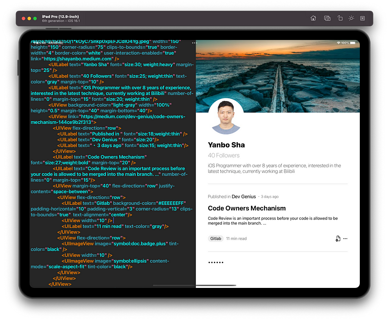

## UIBuilder

This is a simple project based on facebook's Yoga framework (Flex Layout). With this app, you can write you declarative UI on the left editor and see how it looks on the right display in real-time.

## Principle

Flex Layout is a easy way to serialize UI. iPhone, Android even WP like to use XML as the description language. Here, all of the tags will be used directly as the UIView's name to create its instance, and all of the attributes will be transformed into camel case words and the value will be transformed into corresponding type associated with its attribute's name

## Files

* ViewPrinter is the core file transforming xml into UIView instance
* You can check the `PropertyHandler` file to add more property support
* You can check the `ActionHandler` file to add more action support. the builtin support is `link` and `UIImageView.url`
* `Router` is a simple router implementation that I write for completing the `link` action, in this sample project, you can click my photo view and article view to navigate to the relevant websites.
* You can check t he `color-code.plist` and update to change the theme color scheme.
* `HexColor` is a simple extension for UIColor to support init with a hex string.

## Dependencies
All of the dependencies are easily replaced by another one or your own implementation

## Idea
You can transform XML into UIView which means you can fetch the UI from the remote and render locally. You can extend the builtin action support to make it more useful. You can consider using it in like Card Feed, Ads Landing Page and something like that.